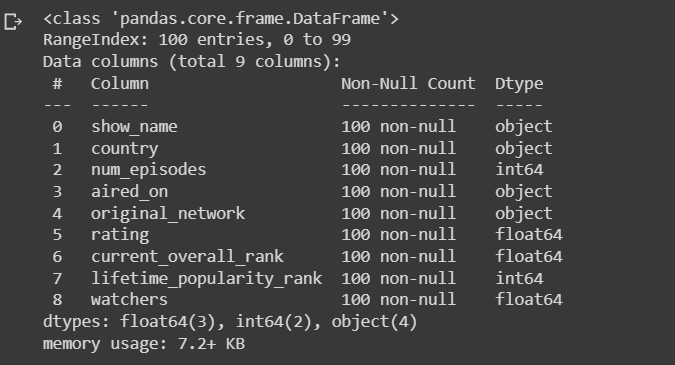

# Ex-01_DS_Data_Cleansing


## AIM
To read the given data and perform data cleaning and save the cleaned data to a file. 

# Explanation
Data cleaning is the process of preparing data for analysis by removing or modifying data that is incorrect ,incompleted , irrelevant , duplicated or improperly formatted. 
Data cleaning is not simply about erasing data ,but rather finding a way to maximize datasets accuracy without necessarily deleting the information. 

# ALGORITHM
### STEP 1
Read the given Data
### STEP 2
Get the information about the data
### STEP 3
Remove the null values from the data
### STEP 4
Save the Clean data to the file

# CODE
## Loan Data
```
import pandas as pd
df=pd.read_csv("Loan_data.csv")
print(df)

df.info()
df.head(10)
df['Loan_ID']=df['Loan_ID'].fillna(df['Dependents'].mode()[0])

df['Dependents']=df['Dependents'].fillna(df['Dependents'].mode()[0])
df['Education']=df['Education'].fillna(df['Dependents'].mode()[0])
df['Self_Employed']=df['Self_Employed'].fillna(df['Self_Employed'].mode()[0])
df['Gender']=df['Gender'].fillna(df['Gender'].mode()[0])
df.head()

df['ApplicantIncome']=df['ApplicantIncome'].fillna(df['ApplicantIncome'].mean())
df['Loan_Amount_Term']=df['Loan_Amount_Term'].fillna(df['Loan_Amount_Term'].mean())
df['LoanAmount']=df['LoanAmount'].fillna(df['LoanAmount'].mean())
df.head()

df['Credit_History']=df['Credit_History'].fillna(df['Credit_History'].median())
df.head()

df.info()
df.isnull().sum()
```
## Data_Set
```
import pandas as pd
df=pd.read_csv("Data_set.csv")
print(df)

df.head(10)

df.info()
df.isnull()
df.isnull().sum()

df['show_name']=df['show_name'].fillna(df['aired_on'].mode()[0])
df['aired_on']=df['aired_on'].fillna(df['aired_on'].mode()[0])
df['original_network']=df['original_network'].fillna(df['aired_on'].mode()[0])
df.head()

df['rating']=df['rating'].fillna(df['rating'].mean())
df['current_overall_rank']=df['current_overall_rank'].fillna(df['current_overall_rank'].mean())
df.head()

df['watchers']=df['watchers'].fillna(df['watchers'].median())
df.head()

df.info()

df.isnull()
df.isnull().sum()
```
## OUTPUT
## For Loan Data
## Data


## Non Null Before


## Mode


## Mean


## Median


## Non Null After


## isnull().sum()


## For Data_Set
## Data


## Non Null Before


## isnull()


## isnull().sum()


## Mode


## Mean


## Median


## Non Null After


## isnull()


## isnull().sum()


## RESULT
Thus,the given data is read,cleansed and the cleaned data is saved into the file.
